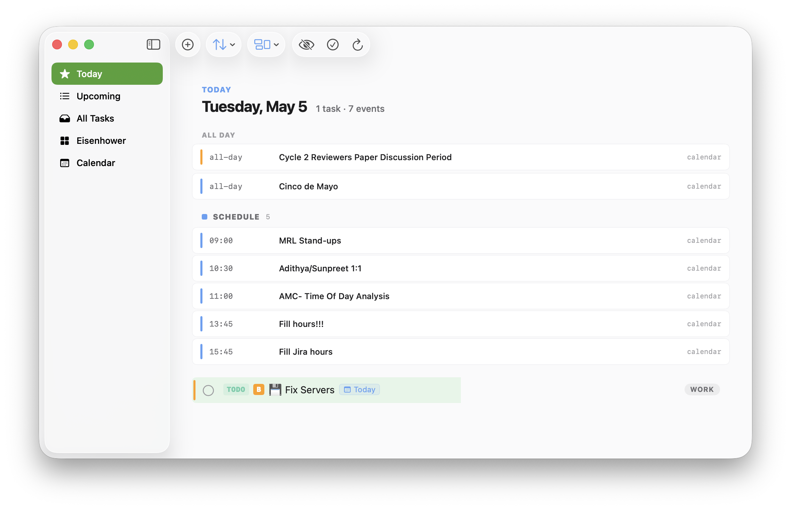
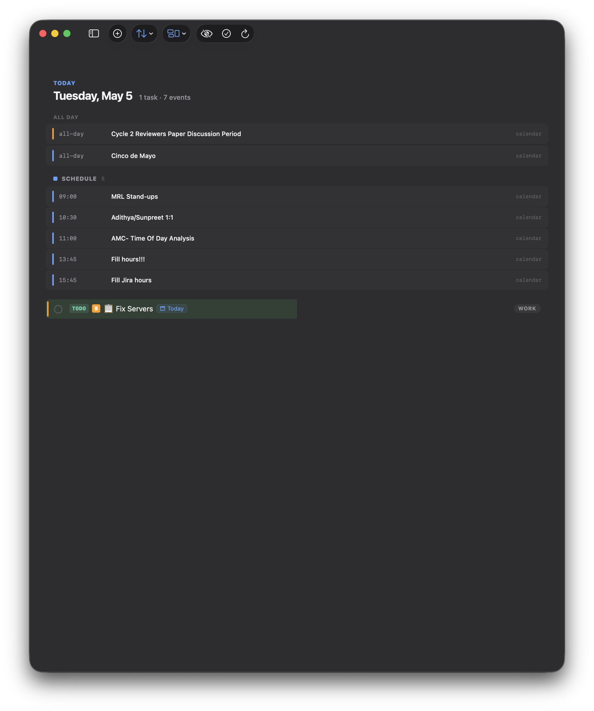
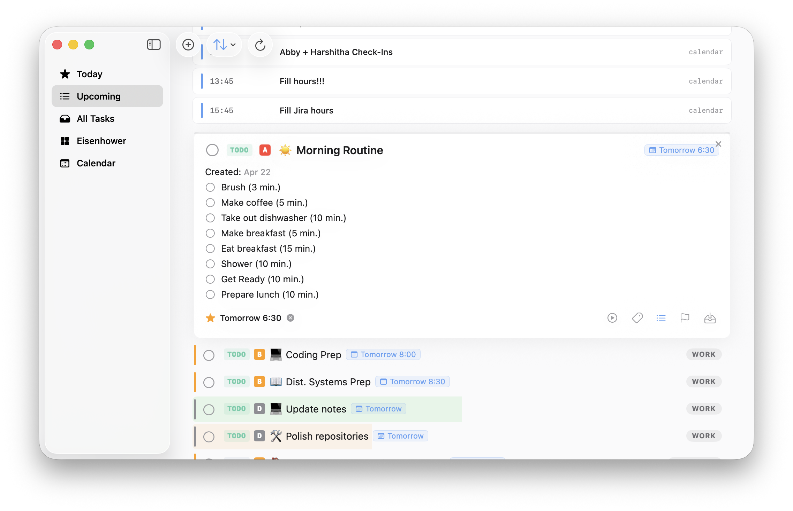
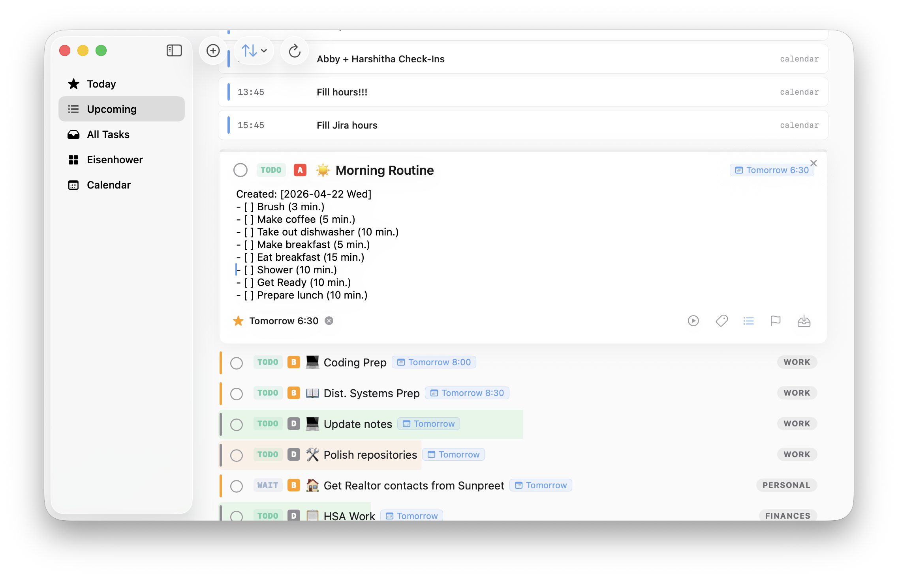
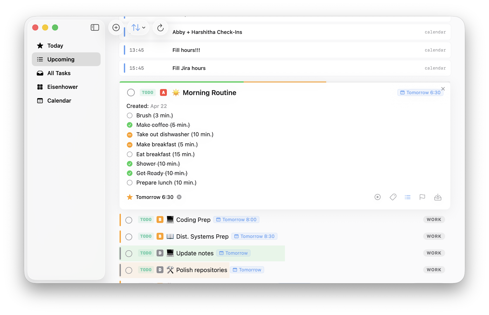
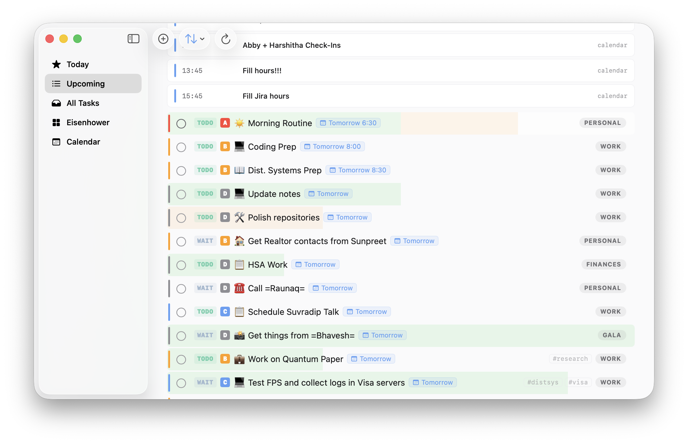
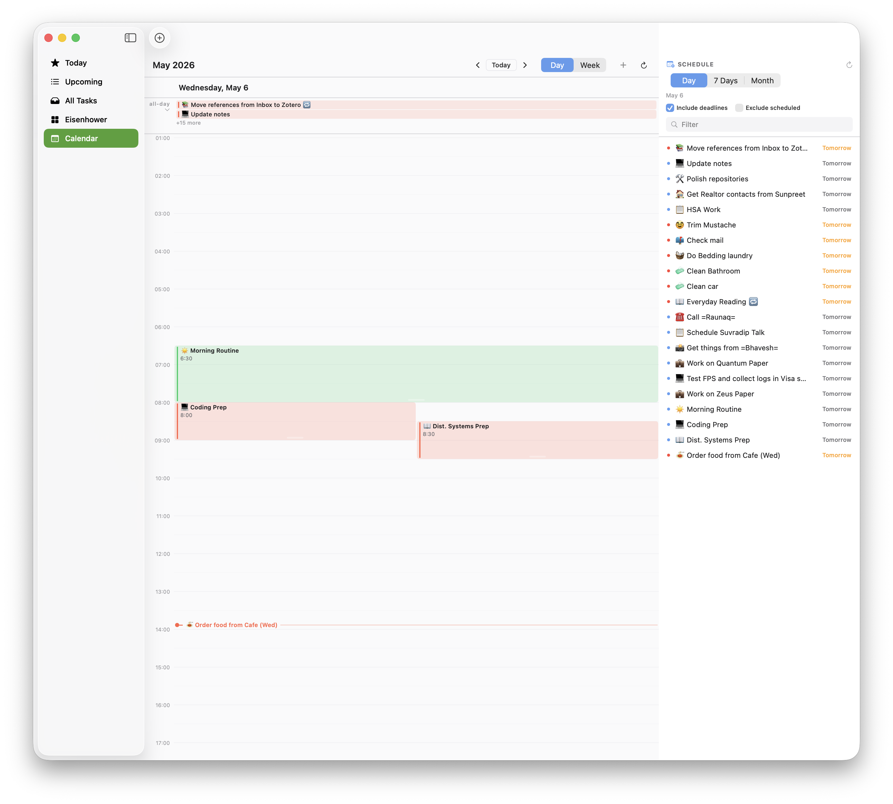

#+title: Emacs Agenda Viewer

*Motivation and AI disclaimer.* I have always liked Things 3 and Todoist for their ease of use. But I always found their feature set incomplete and lacking. I made peace with Emacs as it is powerful and extensible. But the org agenda interface always felt dated and clunky. So this is my vibe-coded attempt to connect a web front-end using emacs-client to the emacs backend to improve the visuals. Yes, this is vibe coded with AI, do what you want with this information. But feature requests and pull requests are welcome.

** Screenshots

Native macOS app, v0.3.1 — Sonoma-vibrancy design with single-line task rows, an inline inspector with explicit edit mode, and configurable progress visualisations.

*** Today view, light + dark

|                                                                          |                                   |

Day-head with relative label and counts, =ALL DAY= calendar events at the top, then a chronological =SCHEDULE= section that interleaves timed events with timed tasks (so an 11:00 event slots between a 09:00 task and a 13:00 task — not lumped into a separate top block).

*** Inspector — rendered notes vs. raw edit

|                                                                                                                                 |                                                                               |

Selecting a task swaps the row for an editable card. Notes render with interactive checkboxes by default — click a box to toggle (it writes through to org via =org-list-struct-fix-box= so parents auto-aggregate). Click anywhere else in the notes area to drop into raw =org= edit mode; blur to save and switch back.

*** Configurable checklist progress

|                                                                                                        |                                                                                             |

Settings → Checklist Progress lets you pick how rows surface checklist completion: a 3pt strip on the card's top edge (left), a small donut at the row end, or a left-to-right background fill (right; green for done, muted orange for in-progress).

*** Calendar view

Day / Week grid with lane-layout for overlapping events, drag-to-reschedule, drag-to-resize (writes time-range timestamps), and a docked schedule tray on the right with date-range filter, =Include deadlines= / =Exclude scheduled= toggles, and a search box.

** Architecture

As of *v0.4.0* the read + transport layer is a Rust daemon (=eavd=). Reads
land on an in-memory index (~2 ms vs. the ~110 ms an =emacsclient= round-trip
costs); mutations and the residual semantic reads (sexp/diary days, capture
templates) proxy to Emacs over a single persistent UNIX socket. Org files
on disk are still the source of truth and Emacs is still the only writer.

#+begin_example
  ┌──────────────┐    HTTP+SSE     ┌──────────────────────────┐
  │   Mac app    │  127.0.0.1:3002 │      eavd (Rust)         │
  │ Web frontend │ ──────────────► │  • orgize parser         │
  └──────────────┘                 │  • in-memory BTreeMap    │
                                   │  • SQLite snapshot       │
                                   │  • notify file watcher   │
                                   │  • agenda evaluator      │
                                   └──────────┬───────────────┘
                                              │ length-prefixed JSON
                                              │ over UNIX socket
                                              ▼
                                   ┌──────────────────────────┐
                                   │  Emacs server            │
                                   │  eav-bridge.el           │  ← thin dispatcher
                                   │  eav.el  (unchanged)     │  ← all org logic
                                   └──────────┬───────────────┘
                                              ▼
                                       Org files on disk
                                       (single writer: Emacs)
#+end_example

- =daemon/= :: Cargo workspace with seven crates: =eav-core= (wire types),
  =eav-parse= (orgize wrapper + tag inheritance), =eav-index= (in-memory
  index + SQLite snapshot + =notify= watcher), =eav-agenda= (day/range
  evaluator), =eav-bridge= (persistent socket client), =eav-server= (axum
  HTTP + SSE), and the =eavd= binary that ties them together.
- =elisp/eav-bridge.el= :: New in-Emacs UNIX-socket dispatcher that exposes
  the existing =eav.el= mutation/sexp surface to =eavd=. =eav.el= itself is
  unchanged.
- =elisp/eav.el= :: As before — every org-semantics function the bridge
  calls. Treat as load-bearing; only add new methods to the bridge by
  registering new entries in =eav-bridge--methods=.
- =src/= :: React + TypeScript + Tailwind CSS frontend, with a new
  =useDaemonEvents= hook that consumes =/api/events= so the UI refreshes
  on file save / clock-in / TODO state change without polling.
- =apps/macos/= :: SwiftUI app. Bundles =eavd= as a helper process
  (=Networking/DaemonHost.swift= spawns it on launch, terminates on quit).
  =Networking/EventSubscriber.swift= consumes the same SSE channel and
  feeds =TasksStore.invalidate(file:)= / =invalidate(taskId:)=.
- =server/= :: Legacy Express server. Still in the tree for shadow-mode
  comparison; v1.0.0 will delete it.

*Express remains available* on its old port (3001) for fallback while
the daemon is dogfooded. Pick the backend by setting the Mac app's *Server
URL* (=Settings → Server URL=) or the =VITE_API_TARGET= env for the web
client (defaults to =http://localhost:3002= now).

** Setup

*** Prerequisites

- *Emacs* with =server-mode= enabled (=M-x server-start= or add =(server-start)= to your init file)
- *Node.js* >= 18 -- for the web frontend build
- *npm* -- ditto
- =emacsclient= on =PATH=
- *Rust* stable -- only at *build* time. End users running the bundled
  =Agenda.app= don't need a Rust toolchain; the daemon is shipped inside
  =Contents/Resources/=.
- *Xcode* + =xcodegen= -- only if you build the Mac app

*** Install

#+begin_src shell
git clone git@github.com:adithyabhatkajake/emacs-agenda-viewer.git
cd emacs-agenda-viewer
npm install
# eavd is built on demand by the Mac app's Run-Script phase or by
# scripts/build-eavd-universal.sh for distribution. To build it
# directly:
cargo build --manifest-path daemon/Cargo.toml --release -p eavd
#+end_src

** Usage

*** Native Mac app (recommended)

Open =Agenda.app= -- it spawns its bundled =eavd= helper, which loads
=eav-bridge.el= into your running Emacs on first connect. There is nothing
to start manually.

#+begin_src elisp
(server-start)        ; once, in your Emacs init
#+end_src

#+begin_src shell
./deploy.sh           ; build + install + relaunch the Mac app
#+end_src

The app's *Server URL* defaults to =http://127.0.0.1:3002= (the bundled
helper) but accepts any =eavd= or Express URL.

*** Web frontend

For local development:

#+begin_src shell
npm run dev           # vite on :5173, proxying /api → :3002 (eavd)
#+end_src

For headless deployment on a remote Mac (=visa-nonsoe= setup):

#+begin_src shell
./deploy-web-eavd.sh   # rsync, build eavd + dist on remote, install
                       # launchd plist that starts eavd with --static-dir
#+end_src

After this the SPA + API are both served by =eavd= on the remote's port
3001. The legacy =./deploy-web.sh= (Express path) is preserved for fallback.

*** Daemon CLI

The =eavd= binary also offers ad-hoc parity / debugging modes:

#+begin_src shell
eavd                                   # default: localhost:3002, no SPA
eavd --http-port 3001 --http-host 0.0.0.0 --static-dir dist
eavd --dump-tasks       --files-from files.json --keywords-from keywords.json
eavd --dump-active-tasks --files-from files.json --keywords-from keywords.json
eavd --dump-agenda-day 2026-05-08 --files-from files.json --keywords-from keywords.json
#+end_src

Useful while comparing daemon output to the Express baseline. The
=--files-from= argument accepts either a one-path-per-line file or the JSON
output of =/api/files=.

*** Keyboard shortcuts

| Key          | Action                     |
|--------------+----------------------------|
| =Cmd+\=      | Toggle sidebar             |
| =Cmd+N=      | New capture                |
| Right-click  | Context menu (edit/refile)  |
| Long-press   | Context menu (mobile)      |

** Features

*** Views
- *Today*: Calendar events (banner), scheduled tasks, deadlines due today/overdue
- *Upcoming*: Next 7 days, grouped by date with events/scheduled/deadlines sub-sections
- *All Tasks*: Every non-done heading with a TODO state
- *Category/File/Tag*: Filter by org category, file, or tag

*** Capture (create new tasks)
- Press =Cmd+N= or click the *+* button in the sidebar to open the capture modal
- Picks up your =org-capture-templates= from Emacs -- all =entry= type templates with static targets are supported
- Templates with function targets/bodies (e.g. denote) are shown grayed as "Emacs only"
- Select a template, type a title, press Enter -- org-capture runs in Emacs with =:immediate-finish=
- All template expansions (=%u=, =%t=, =%<=...=>= timestamps, etc.) are handled by org itself

*** Task actions (click/right-click to use)
- *TODO state*: Click the state pill (TODO/NEXT/WAIT/etc.) to pick any state from the sequence
- *Priority*: Click the priority badge (A/B/C/D) to change or remove priority
- *Scheduled/Deadline*: Click to open date+time picker with quick options (Today, Tomorrow, Next Week) and a mini calendar
- *Notes*: Click a task to expand it; right-click the row (or the card) and pick =Edit= to drop into raw =org= edit mode. =Save= writes back, =Discard= reverts to the original. Org checklists (=- [ ]=) render as interactive checkboxes, with nested items indented to reflect the list hierarchy. Parent checkboxes auto-aggregate from descendants ([X] when all children done, [-] when some done or in progress) via org's native =org-list-struct-fix-box=.
- *Clock*: Expand a task and click "Clock In" to start =org-clock-in=. A live timer banner appears at the top. Click "Stop" or "Stop Clock" to clock out.
- *Edit title*: Right-click (or long-press on mobile) a task and select "Edit title"
- *Refile*: Right-click (or long-press on mobile) a task and select "Refile" to move it to another heading
- *Calendar events*: Active timestamps in the body (=<YYYY-MM-DD Day HH:MM>=, including ranges and =<a>--<b>= spans) render as formatted chips. Parsing is delegated to =org-element-timestamp-parser=, so repeaters, warnings, and time-ranges are interpreted exactly as org sees them.

*** Sorting & Grouping
- *Sort*: Agenda order, priority, category (toolbar buttons)
- *Group*: Multi-select toggleable groups: agenda (scheduled vs deadlines), priority, category, state. Groups are collapsible by clicking the header.

*** Org features supported
- All TODO keyword sequences (custom states like WAIT, FLLW, SMDY, PROJ, DRFT, PROG)
- Priorities A-D
- Scheduled dates with repeaters (=.+1d=, =++1w=, etc.)
- Deadlines with warning days (=-3d=) respecting =org-deadline-warning-days=
- Active timestamps in body text
- Org links, bold, italic, code/verbatim rendering in titles and notes
- Org checklists with progress bar, nested list hierarchy, and native parent-checkbox aggregation
- Org clocking (clock-in, clock-out, live timer)
- Property drawers and logbook preserved during edits

*** Running as a Background Service (macOS)

A launchd plist template ships at =scripts/eav.server.plist.template=. The
=scripts/install-launchd.sh= installer renders it with paths for your machine
(working dir, =npx= location, log path), writes it to
=~/Library/LaunchAgents/dev.eav.server.plist=, and loads it via =launchctl=.

#+begin_src shell
# Install (renders the template, writes the plist, loads the service)
./scripts/install-launchd.sh

# Restart after eav.el / server changes
launchctl kickstart -k gui/$(id -u)/dev.eav.server

# View logs
tail -f ~/Library/Logs/eav-server.log

# Uninstall (boots the service out + removes the plist)
./scripts/install-launchd.sh --uninstall
#+end_src

The service runs at login, auto-restarts on crash, binds to =0.0.0.0:3001=
so it's accessible over Tailscale or any local network.

*** Mobile Access

The UI is fully responsive -- use it from your phone's browser. If you run Tailscale, just visit =http://<your-tailscale-ip>:3001=.

*** Native macOS / iOS app

Source lives under =apps/macos/= -- a SwiftUI app that talks to the same Express server. Two targets share one codebase: =EmacsAgendaViewerMac= (macOS, NavigationSplitView, drag-and-drop calendar, EventKit sync) and =EmacsAgendaViewer= (iOS, list-style UI). XcodeGen drives the project from =project.yml= so the =.xcodeproj= isn't tracked.

#+begin_src shell
cd apps/macos
brew install xcodegen   # one-time
xcodegen generate
open EmacsAgendaViewer.xcodeproj
# Run the EmacsAgendaViewerMac scheme, point Settings at http://localhost:3001
#+end_src

Highlights vs. the web UI:

- Sonoma-vibrancy design adapted from a claude.ai/design mockup — single-line task rows with inline state pill, solid colored priority box, scheduled/deadline chips, tag chips, and a category pill on the right
- Today view interleaves timed events and timed tasks chronologically in a =SCHEDULE= section; all-day events surface above; untimed tasks group by category below
- Things 3-style inline inspector: clicking a task swaps the row for an editable card with title field, interactive checklist notes (click to toggle, click empty area to enter raw-text edit), state/priority/scheduled/deadline pickers all click-to-edit, footer row with clock toggle, tags editor, refile, and a top-edge progress strip
- Compact dark Things-3 date picker (Today, This Evening, month grid, inline =HH:MM= time row, Someday, natural-language =When= field)
- Settings: highlight rows by priority or TODO state (edge bar or background tint); checklist progress style (top line / circle / background fill)
- Calendar grid (Day/Week, hours 0-24) with inline header bar, day-header row with circled-today styling, column separators, snap-preview drag, lane layout for overlapping events, drag-to-reschedule, drag-to-resize (writes time-range timestamps); schedule tray docks beside the grid
- Multi-clock dock: run several clocks simultaneously; stop pushes a =CLOCK:= entry into the task's =LOGBOOK= drawer (=POST /api/clock/log= endpoint + =eav-add-clock-entry= elisp). Completing a task auto-stops and logs its clock. Loose CLOCK lines from prior org configs can be folded into a =:LOGBOOK:= drawer via =POST /api/clock/tidy= (one-click "Tidy" banner in the inspector when detected)
- EventKit two-way sync: link an org task to a Calendar event via =:GCAL_EVENT_ID:= property; changes flow both ways
- Per-server category color overrides, light/dark/system theme, persistent active clocks across launches

Pre-built DMGs ship with each tagged release on
[[https://github.com/adithyabhatkajake/emacs-agenda-viewer/releases][GitHub Releases]]
(=Agenda-X.Y.Z.dmg=). The =Release macOS app= GitHub Action builds them on
=macos-15= unsigned (=CODE_SIGN_IDENTITY=-=); on first launch you'll need to
=Right-click → Open= once to bypass Gatekeeper.

To build a DMG locally:

#+begin_src shell
cd apps/macos
xcodebuild -project EmacsAgendaViewer.xcodeproj -scheme EmacsAgendaViewerMac \
  -configuration Release -derivedDataPath build CODE_SIGN_IDENTITY=- CODE_SIGNING_REQUIRED=NO
hdiutil create -volname Agenda -srcfolder build/Build/Products/Release/Agenda.app \
  -ov -format UDZO Agenda.dmg
#+end_src

** Testing

Two suites — both exercise real code paths, no mocks at the parsing or business-logic layer.

*** Elisp (=npm test=)

ERT tests in =elisp/eav-tests.el= using fixture =.org= files under =elisp/tests/fixtures/=:
- =calendar-events.org= -- timestamps of every flavor (single date, date+time, time-range same day, =<a>--<b>= range across midnight, multi-day range, repeaters =+=/=++=/=.+=, warning periods, SCHEDULED/DEADLINE, multiple in body, inactive). Each test parses the fixture through =eav--parse-timestamp= / =eav--extract-active-timestamps= and asserts on the structured output.
- =nested-lists.org= -- one heading per checklist scenario (=-=, =+=, =*=, =1.=, =1)=, mixed bullets, three-level nesting). Each heading carries the propagated body in an =:EXPECTED:= property; the test saves the input body via =eav-set-heading-notes= (which runs =org-list-struct-fix-box=) and compares the result to expected.

*** End-to-end (=npm run test:e2e=)

Playwright specs in =tests/e2e/= run against real Chromium (desktop, 1280x800) and real WebKit (mobile, iPhone 13 profile). =/api/*= calls are mocked via =page.route= with regex patterns scoped to the API path (so they don't shadow Vite's =/src/api/*= module requests); the clock is frozen with =page.clock.install= to keep the agenda-day URL deterministic. Covers the original Game Night bug: active-range timestamps in notes must render as formatted chips, not raw angle-bracket text, on both viewports.

** Missing features

- Effort estimation editing
- Search/filter by text in the web UI
- Habit tracking visualization
- Agenda custom commands (only the default day/week view is used)
- Web UI doesn't have tag editing yet; the native macOS app does (Settings → Tag chip in the inspector footer)

** Tech stack

- [[https://react.dev][React 19]] + [[https://www.typescriptlang.org][TypeScript]]
- [[https://vite.dev][Vite 6]]
- [[https://tailwindcss.com][Tailwind CSS 3]]
- [[https://expressjs.com][Express 5]]
- [[https://orgmode.org][Org-mode]] via =emacsclient=
